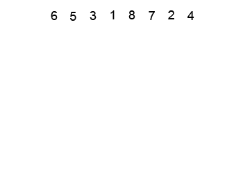
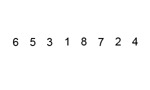
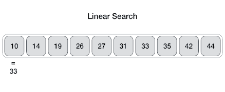
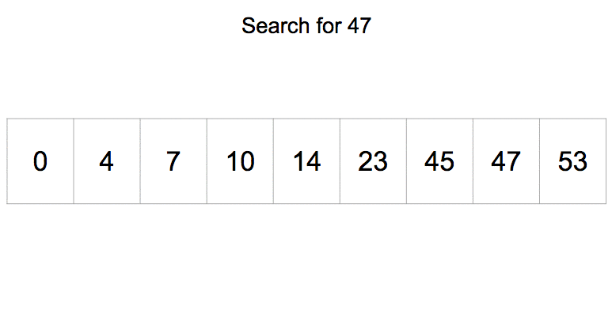

# Algoritmalar
Bu kısımda sıralama ve arama algoritmalarına dair anlatımlar yer alıyor.
# Insertion Sort
Bir sayı dizisini sıralamak için uygulayabileceğimiz algoritmalardan birisi insertion sort. Bu algoritmanın çalışma mantığını size açıklamaya çalışacağım.
<br/>

<br/>
Insertion sort algoritması diziyi iki parçaya bölünmüş ayrı ayrı iki dizi gibi ele alır. Başlangıçta soldaki dizide sadece dizinin birinci elemanı vardır, sağdaki dizide ise geriye kalan elemanlar. Devamında sağdaki dizinin ilk elemanını alır ve soldaki dizinin ilk elemanından büyük veya küçük olmasına göre soldaki dizi üzerine geçirerek sıralar. Bu işlem benzer şekilde devam eder ve sağdaki diziden eleman alarak alınan elemanın soldaki dizi içerisinde uygun pozisyona yerleştirilmesini sağlar. Sağdaki dizideki son elemanın soldaki dizide yerine yerleştirilmesine kadar bu aşama kendini tekrarlar.

Bu algoritmanın C ve Python dillerinde implementasyonunu aşağıda veriyorum.

Insertion Sort C İmplementasyonu:
```
#include <stdio.h>
 
void insertionSort(int D[], int N) {
    int i, k, ekle;
    for(i=1; i<N; i++) {
        ekle = D[i];
        for(k=i-1; k>=0 && ekle<=D[k]; k--) {
            D[k+1] = D[k];
        }
        D[k+1] = ekle;
    }
}
 
int main() {
    int dizi[] = {5, 3, 11, 9, 21, 18, 20, 4};
    int uzunluk = sizeof(dizi) / sizeof(dizi[0]);
    insertionSort(dizi, uzunluk);
     
    for(int i=0; i<uzunluk; i++) {
        printf("%d ", dizi[i]);
    }
    printf("\n");
     
    return 0;
}
```

Insertion Sort Python İmplementasyonu:
```
def insertion_sort(my_list):
    for i in range(0, len(my_list)):
        current_value = my_list[i]
        k = i - 1
        while k>= 0 and current_value <= my_list[k]:
            my_list[k+1] = my_list[k]
            k -= 1
        my_list[k+1] = current_value
    return my_list
 
listem = [5, 3, 11, 9, 21, 18, 20, 4]
 
print(insertion_sort(listem))
```
Daha iyi anlamak isterseniz debugging yaparak veya kod bloklarının içerisinde uygun gördüğünüz yerlere yazdırma işlemleri ekleyerek inceleyebilirsiniz. Umarım açıklayıcı olmuştur.
# Selection Sort
Bir sayı dizisini sıralamak için kullanabileceğimiz algoritmalardan biri selection sort yani seçmeli sıralama algoritmasıdır. Bu algoritma şöyle bir mantıkla çalışır: İlk olarak dizinin en küçük elemanını tespit eder ve dizinin en başına yerleştirir. Sonra ilk elemanı ayrı bir şekilde dizinin başında tutar ve geri kalan elemanlardan en küçüğünü bulur ve ikinci sıraya yerleştirir böylece sıralanmış iki eleman elde edilir ve geri kalan elemanlardan gene en küçüğünü bularak sıralanmış olanların devamına ekler ve bu böyle devam eder.

Benzer şekilde sıralama işlemini dizinin başından değil sonundan başlayarak benzer mantıkla sıralama yapabilir.
<br/>

<br/>
Selection Sort C İmplementasyonu:
```
#include <stdio.h>
 
void selectionSort(int D[], int N) {
    int i, j, index, enKucuk;
    for(i=0; i<(N-1); i++) {
        enKucuk = D[N-1];
        index = N - 1;
        for(j=i; j<(N-1); j++) {
            if(D[j] < enKucuk) {
                enKucuk = D[j];
                index = j;
            }
        }
        D[index] = D[i];
        D[i] = enKucuk;
 
    }
}
 
int main() {
    int dizi[] = {5, 3, 11, 9, 21, 18, 20, 4};
    int uzunluk = sizeof(dizi) / sizeof(dizi[0]);
    selectionSort(dizi, uzunluk);
    for(int i=0; i<uzunluk; i++) {
        printf("%d ", dizi[i]);
    }
    printf("\n");
    return 0;
}
```
Selection Sort Python İmplementasyonu:
```
def selection_sort(A):
    for i in range(len(A)): 
        min_idx = i 
        for j in range(i+1, len(A)): 
            if A[min_idx] > A[j]: 
                min_idx = j    
        A[i], A[min_idx] = A[min_idx], A[i] 
    return A
 
my_list = [5, 3, 11, 9, 21, 18, 20, 4]
print(selection_sort(my_list))
```
Daha detaylı anlamak için debugging yapabilirsiniz veya ilgili yerlere yazdırma fonksiyonları ekleyerek inceleyebilirsiniz. Aynı zamanda yukarıdaki görselde anlamanıza yardımcı olacaktır.
# Bubble Sort
Bubble Sort algoritması tasarımı basit ancak etkin olmayan bir algoritmadır. Bu algoritma elemanlar üzerinde başlangıçtan sona doğru ilerlerken komşu iki elemanın yer değiştirmesine dayanır. Elemanlar üzerinde her bir dolaşma sonucunda en büyük eleman en sağda yerini alır ve bir sonraki dolaşmadan hariç tutulur. Bu işlemler elemanlar dizisi doğru bir şekilde sıralanana kadar devam eder. Daha iyi anlamak için aşağıdaki resme, Python ve C dilindeki implementasyonuna göz atabilirsiniz. Bilgisayarınızda kodlayarak çalıştırmak da anlamanıza yardımcı olacaktır.
<br/>

<br/>
Bubble Sort C İmplementasyonu:
```
#include <stdio.h>
 
void bubbleSort(int D[], int N) {
    int gecici, i, k;
    for(i=0; i<(N-1); i++) {
        for(k=0; k<(N-1-i); k++) {
            if (D[k] > D[k+1]) {
                gecici = D[k];
                D[k] = D[k+1];
                D[k+1] = gecici;
            }
        }
    }
}
 
int main() {
    int dizi[] = {5, 3, 11, 9, 21, 18, 20, 4};
    int uzunluk = sizeof(dizi) / sizeof(dizi[0]);
    bubbleSort(dizi, uzunluk);
     
    for(int i=0; i<uzunluk; i++) {
        printf("%d ", dizi[i]);
    }
    printf("\n");
    return 0;
}
```
Bubble Sort Python Dili İmplementasyonu:
```
def bubble_sort(arr): 
    n = len(arr) 
    for i in range(n): 
        for j in range(0, n-i-1): 
            if arr[j] > arr[j+1] : 
                arr[j], arr[j+1] = arr[j+1], arr[j] 
    return arr
 
 
my_list = [5, 3, 11, 9, 21, 18, 20, 4]
 
print(bubble_sort(my_list))
```
# Merge Sort
Merge Sort böl ve yönet yaklaşımına dayanan, rekürsif bir algoritmadır. Sıralanması istenen sayı dizisini öncelikle iki parçaya böler, devamında kalan parçaları böle böle her parçada sadece bir eleman kalana kadar bu işlemi devam ettirir. Bu aşamadan sonra birleştirme aşamasına geçer. Birleştirme aşamasında tek başına kalan elemanları sırasıyla sıralı bir şekilde birleştirir.
<br/>

<br/>
Merge Sort C İmplementasyonu:
```
#include <stdio.h>
 
void merge(int arr[], int l, int m, int r) {
    int i, j, k;
    int n1 = m - l + 1;
    int n2 = r - m;
    int L[n1], R[n2];
    
    for (i = 0; i < n1; i++)
        L[i] = arr[l + i];
    for (j = 0; j < n2; j++)
        R[j] = arr[m + 1 + j];
  
    
    i = 0; 
    j = 0; 
    k = l; 
    while (i < n1 && j < n2) {
        if (L[i] <= R[j]) {
            arr[k] = L[i];
            i++;
        }
        else {
            arr[k] = R[j];
            j++;
        }
        k++;
    }
 
    while (i < n1) {
        arr[k] = L[i];
        i++;
        k++;
    }
 
    while (j < n2) {
        arr[k] = R[j];
        j++;
        k++;
    }
}
 
void mergeSort(int arr[], int l, int r) {
    if (l < r) {
        int m = l + (r - l) / 2;
        mergeSort(arr, l, m);
        mergeSort(arr, m + 1, r);
        merge(arr, l, m, r);
    }
}
 
int main() {
    int dizi[] = {5, 3, 11, 9, 21, 18, 20, 4};
    int uzunluk = sizeof(dizi) / sizeof(dizi[0]);
    mergeSort(dizi, 0, uzunluk - 1);
     
    for(int i=0; i<uzunluk; i++) {
        printf("%d ", dizi[i]);
    }
    printf("\n");
    return 0;
}
```
Merge Sort Python İmplementasyonu:
```
def merge_sort(arr):
    if len(arr) > 1: 
        mid = len(arr)//2
        L = arr[:mid]
        R = arr[mid:]
        merge_sort(L)
        merge_sort(R)
  
        i = j = k = 0
        while i < len(L) and j < len(R):
            if L[i] < R[j]:
                arr[k] = L[i]
                i += 1
            else:
                arr[k] = R[j]
                j += 1
            k += 1
  
        while i < len(L):
            arr[k] = L[i]
            i += 1
            k += 1
  
        while j < len(R):
            arr[k] = R[j]
            j += 1
            k += 1
    return arr
 
my_list = [5, 3, 11, 9, 21, 18, 20, 4]
 
print(merge_sort(my_list))
```
# Heap Sort
Heap Sort karşılaştırmaya dayalı Binary Heap veri yapısı tabanlı bir sıralama algoritmasıdır. İlk aşamada maksimum değeri bulup onu en sona yerleştirmesinden ötürü Selection Sort ile benzerlik gösterir. Kalan elemanlar için işlemi benzer şekilde tekrarlayarak sıralamayı tamamlar. Algoritmanın tümüyle kavranmasının yazıyla sağlanmasının zor olacağından hareketli resmi (GIF) ve kodları takip etmeniz yararınıza olur.
<br/>

<br/>
Heap Sort C İmplementasyonu:
```
#include <stdio.h>
 
void swap(int *a, int *b) {
    int temp = *a;
    *a = *b;
    *b = temp;
}
 
void heapify(int arr[], int n, int i) {
    int largest = i;
    int left = 2 * i + 1;
    int right = 2 * i + 2;
 
    if (left < n && arr[left] > arr[largest])
        largest = left;
 
    if (right < n && arr[right] > arr[largest])
        largest = right;
 
    if (largest != i) {
        swap(&arr[i], &arr[largest]);
        heapify(arr, n, largest);
    }
}
 
void heapSort(int arr[], int n) {
    for (int i = n / 2 - 1; i >= 0; i--)
        heapify(arr, n, i);
 
    for (int i = n - 1; i >= 0; i--) {
        swap(&arr[0], &arr[i]);
        heapify(arr, i, 0);
    }
}
 
int main() {
    int dizi[] = {5, 3, 11, 9, 21, 18, 20, 4};
    int uzunluk = sizeof(dizi) / sizeof(dizi[0]);
    heapSort(dizi, uzunluk);
     
    for(int i=0; i<uzunluk; i++) {
        printf("%d ", dizi[i]);
    }
    printf("\n");
    return 0;
}
```
Heap Sort Python İmplementasyonu:
```
def heapify(arr, n, i):
    largest = i  
    l = 2 * i + 1   
    r = 2 * i + 2   
 
    if l < n and arr[largest] < arr[l]:
        largest = l
 
    if r < n and arr[largest] < arr[r]:
        largest = r
  
    if largest != i:
        arr[i], arr[largest] = arr[largest], arr[i]  
        heapify(arr, n, largest)
  
def heap_sort(arr):
    n = len(arr)
 
    for i in range(n//2 - 1, -1, -1):
        heapify(arr, n, i)
 
    for i in range(n-1, 0, -1):
        arr[i], arr[0] = arr[0], arr[i]  
        heapify(arr, i, 0)
 
    return arr
 
my_list = [5, 3, 11, 9, 21, 18, 20, 4]
 
print(heap_sort(my_list))
```
# Quick Sort
Quick Sort algoritması sıralama işlemini yapabilmek üzere böl ve yönet yaklaşımını kullanır. Sıralanacak dizi belirlenen bir sınır değere göre iki ayrı diziye ayrılır. Mesala sınıf değer 5 ise 5 ten küçük elemanlar ve 5 ten büyük elemanlar olarak dizi ikiye ayrılmış olur. Seçilen sınır değer dizi elemanlarından biridir. Tercihe göre bu sınır değer dizilerden birine konabilir. Algoritma devamında bu dizileride kendi içinde iki ayrı diziye böler ve diziler parçalanamayacak duruma gelene kadar bu böyle devam eder. Parçalanmış elemanların rekürsif fonksiyon çağırılmasıyla birlikte sıralanması sonucu sıralı dizinin elde edilmesiyle algoritma son bulur.
<br/>

<br/>
Quick Sort C İmplementasyonu:
```
#include <stdio.h>
 
void quickSort(int dizi[], int sol, int sag) {
    int j, k;
    int ortadaki, gecici;
 
    k = sol;
    j = sag;
    ortadaki = dizi[(sol+sag)/2];
 
    do {
        while(dizi[k]<ortadaki && k<sag) {
            k++;
        }
        while(ortadaki<dizi[j] && j>sol) {
            j--;
        }
        if(k<=j) {
            gecici = dizi[k];
            dizi[k] = dizi[j];
            dizi[j] = gecici;
            k++;
            j--;
        }
    } while(k<=j);
 
    if (sol<j) {
        quickSort(dizi, sol, j);
    }
    if (k<sag) {
        quickSort(dizi, k, sag);
    }
}
 
int main() {
    int dizi[] = {5, 3, 11, 9, 21, 18, 20, 4};
    int uzunluk = sizeof(dizi) / sizeof(dizi[0]);
    quickSort(dizi, 0, uzunluk - 1);
     
    for(int i=0; i<uzunluk; i++) {
        printf("%d ", dizi[i]);
    }
    printf("\n");
    return 0;
}
```
Quick Sort Python İmplementasyonu:
```
def partition(arr, low, high): 
    i = (low-1)
    pivot = arr[high]
   
    for j in range(low, high):
        if arr[j] <= pivot: 
            i = i+1
            arr[i], arr[j] = arr[j], arr[i] 
   
    arr[i+1], arr[high] = arr[high], arr[i+1] 
    return (i+1) 
   
def quick_sort(arr, low, high): 
    if len(arr) == 1: 
        return arr 
    if low < high: 
        pi = partition(arr, low, high) 
        quick_sort(arr, low, pi-1) 
        quick_sort(arr, pi+1, high) 
    return arr
 
my_list = [5, 3, 11, 9, 21, 18, 20, 4]
 
print(quick_sort(my_list, 0, (len(my_list) -1)))
```
Daha iyi anlamak için kodlar içerisine yazdırmak fonksiyonları ekleyebilir veya debugging yaparak değişkenleri inceleyebilirsiniz.
# Linear Search
Linear Search (Doğrusal Arama) aynı zamanda Sequential Search (Ardışıl Arama) ismiyle de bilinmektedir. Bu algoritma en sade arama algoritmasıdır. Yaptığı iş birinci elemandan başlayarak aranan eleman bulunana kadar sayı dizisi üzerinde sırayla gezmektir.
<br/>

<br/>
Linear Search C İmplementasyonu:
```
#include <stdio.h>
 
int linearSearch(int dizi[], int N, int aranan) {
    for(int i=0; i<N; i++) {
        if (dizi[i] == aranan) {
            return i;
        }
    }
    return -1;
}
 
int main() {
    int dizi[] = {5, 3, 11, 9, 21, 18, 20, 4};
    int uzunluk = sizeof(dizi) / sizeof(dizi[0]);
    int aranan = 21;
    int arananElemanIndex = linearSearch(dizi, uzunluk, aranan);
    printf("Aranan elemanın indeksi: %d\n", arananElemanIndex);
    return 0;
}
```
Linear Search Python İmplementasyonu:
```
def linear_search(liste, aranan):
    for i in range(0, len(liste)):
        if (liste[i] == aranan):
            return i
    return -1
 
liste = [5, 3, 11, 9, 21, 18, 20, 4]
indeks = linear_search(liste, 21)
print('Aranan elemanın indeksi: {0}'.format(indeks))
```
# Binary Search
Binary Search (İkili Arama) algoritması sadece sıralı veriler üzerinde çalışır. Algoritma ilk önce dizinin ortadaki elemanına bakar eğer aranan ortadaki eleman değilse, aranan eleman ya ortadaki elemanın solunda ya da sağındadır veya veriler içinde bulunmuyor da olabilir. Elemanın hangi tarafta olduğu ortadaki elemandan büyük veya küçük olmasına göre belirlenir. Eğer eleman büyük ise dizinin sağ tarafına geçilerek o taraftadaki ortadaki eleman değerine bakılır. Yine bulunmazsa bu ortadaki eleman değerine göre o elemanın sağına veya soluna geçilerek benzer şekilde arama süreci işler.
<br/>

<br/>
Binary Search C İmplementasyonu:
```
#include <stdio.h>
 
int binarySearch(int D[], int N, int aranan) {
    int ortadaki, sol=0, sag=N-1;
    while(sol<=sag) {
        ortadaki = (sol+sag)/2;
        if (aranan == D[ortadaki]) {
            return ortadaki;
        } else if (aranan > D[ortadaki]) {
            sol = ortadaki + 1;
        } else {
            sag = ortadaki - 1;
        }
    }
    return -1;
}
 
 
int main() {
    int dizi[] = {3, 4, 5, 9, 11, 18, 20, 21};
    int uzunluk = sizeof(dizi) / sizeof(dizi[0]);
    int aranan = 21;
    int arananElemanIndex = binarySearch(dizi, uzunluk, aranan);
    printf("Aranan elemanın indeksi: %d\n", arananElemanIndex);
    return 0;
}
```
Binary Search Python İmplementasyonu:
```
def binary_search(liste, aranan):
    sol = 0
    sag = len(liste) - 1
    while (sol <= sag):
        ortadaki = (sol + sag) // 2
        if (aranan == liste[ortadaki]):
            return ortadaki
        elif (aranan > liste[ortadaki]):
            sol = ortadaki + 1
        else:
            sag = ortadaki -1
    return -1
 
liste = [3, 4, 5, 9, 11, 18, 20, 21]
indeks = binary_search(liste, 21)
print('Aranan elemanın indeksi: {0}'.format(indeks))
```


