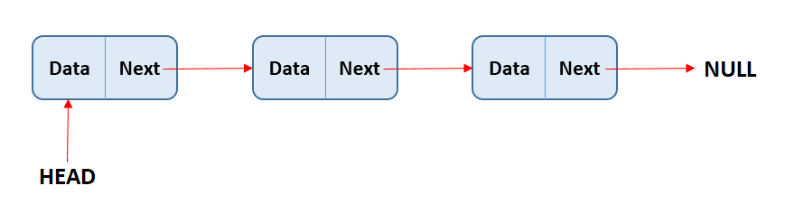
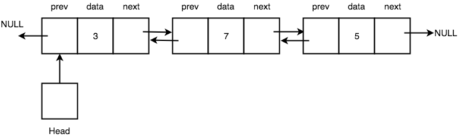
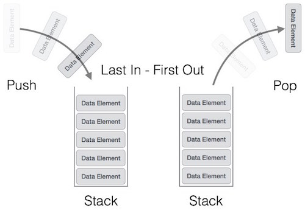
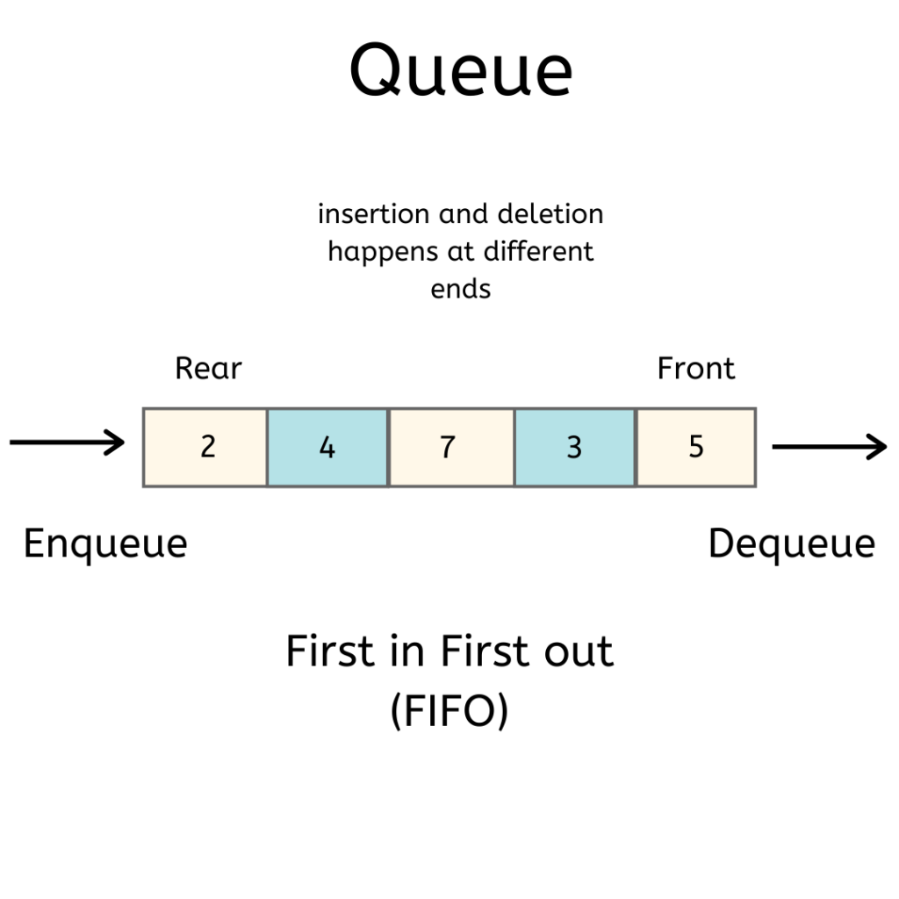
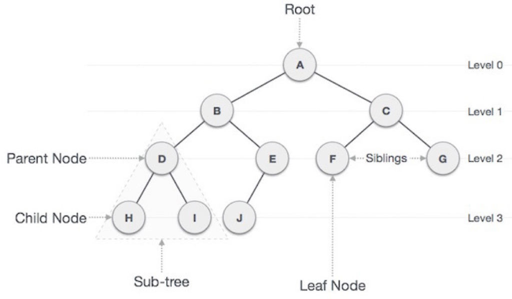

# Veri Yapıları
Bu kısımda programlamada kullanılan veri yapılarına dair anlatımlar yer alıyor.

# Linked List
Linked List (Bağlantılı Liste) elemanların birbirine sanal bağlantılar yoluyla art arda sıralı bir şekilde bağlandığı bir liste veri yapısıdır.
<br/>

<br/>
Linked List tipik olarak veri bloğu ve bağ kısmından oluşur. Bağ kısmı bir sonraki veriyi işaret eder. Listenin ilk elemanı head, front veya first (ilk) olarak adlandırılır. Son elemanı ise tail, rear veya last (son) olarak isimlendirilebilir. Liste ara düğümlere doğrudan erişemez, en baştan head olarak adlandırdığımız elemandan başlayarak sıra sıra gitmek zorundadır. Liste üzerinde bir verinin aranması için verinin liste üzerindeki sırası kadar çevrim yapılmak zorundadır. Eğer liste bir sıralı liste değilse yeni eklenen elemanlar son elemanın hemen arkasına eklenebilir. Ancak tail diye adlandırdığımız son eleman değişkeni kullanılmıyorsa gene listenin başından sonuna kadar gidilmesi gerekir. Listede silme işlemi yapılabilmesi için önce silinecek node (düğüm) yani eleman arama yaparak bulunmalıdır. Bulunduktan sonra düğümün bağlantısı silinerek aradan çıkarılır ve bir önceki düğümün bağlantısı silinen düğümden sonra gelen düğüme bağlanır. Böylece silme işlemi gerçekleşir.

Linked List C İmplementasyonu:
```
#include <stdio.h>
#include <string.h>
#include <stdlib.h>
 
typedef struct baglantiliListe {
    char mesaj[100];
    struct baglantiliListe *arka;
} linkedList;
 
linkedList *ilk = NULL;
linkedList *son = NULL;
 
void ekle(linkedList *eklenecek) {
    if (ilk != NULL) {
        son->arka = eklenecek;
        son = eklenecek;
        eklenecek->arka = NULL;
    } else {
        ilk = eklenecek;
        son = eklenecek;
        eklenecek->arka = NULL;
    }
}
 
int listele() {
    linkedList *p;
    p = ilk;
    if (p == NULL) {
        return -1;
    }
    while (p != NULL) {
        printf("mesaj: %s\n", p->mesaj);
        p = p->arka;
    }
    return 0;
}
 
linkedList *ara(char *aranan) {
    linkedList *p;
    p = ilk;
    while (p) {
        if (strcmp(p->mesaj, aranan) == 0) {
            return p;
        }
        p = p->arka;
    }
    return NULL;
}
 
linkedList *sil(char *silinecek) {
    linkedList *p, *birOnceki;
    p = ilk;
    birOnceki = NULL;
 
    while (p != NULL) {
        if (strcmp(silinecek, p->mesaj) == 0) {
            break;
        }
        birOnceki = p;
        p = p->arka;
    }
 
    if (p != NULL) {
        if (birOnceki == NULL) {
            if (ilk == son) {
                ilk = NULL;
                son = NULL;
            } else {
                ilk = ilk->arka;
            }
        } else {
            birOnceki->arka = p->arka;
            if (birOnceki->arka == NULL) {
                son = birOnceki;
            }
            free(p);
            return p;
        }
    } else {
        return NULL;
    }
}
 
int main() {
    linkedList *p = malloc(sizeof(linkedList));
    strcpy(p->mesaj, "Merhaba");
    ekle(p);
 
    linkedList *q = malloc(sizeof(linkedList));
    strcpy(q->mesaj, "Nasılsın");
    ekle(q);
 
    printf("Listeleme sonucu:\n");
    listele();
    printf("\n");
 
    linkedList *r;
    r = ara("Nasılsın");
    if (r != NULL) {
        printf("Bulundu: %s\n", r->mesaj);
    } else {
        printf("Bulunamadı.\n");
    }
    printf("\n");
 
    sil("Nasılsın");
    printf("Silme işlemi sonrası listeleme sonucu:\n");
    listele();
    return 0;
}
```
Linked List Python İmplementasyonu:
```
class Node: 
    def __init__(self, data): 
        self.data = data  
        self.next = None  
                         
class LinkedList: 
    def __init__(self):  
        self.head = None
        self.tail = None
     
    def add(self, node):
        if (self.head != None):
            self.tail.next = node
            self.tail = node
            node.next = None
        else:
            self.head = node
            self.tail = node
            node.next = None
 
    def list_nodes(self):
        h = self.head
        if (h == None):
            return -1
        while (h != None):
            print("Data: {0}".format(h.data))
            h = h.next
        return 0
     
    def search(self, value):
        h = self.head
        while (h != None):
            if (h.data == value):
                return h
            h = h.next
        return None
     
    def delete(self, value):
        h = self.head
        previous = None
 
        while (h != None):
            if (h.data == value):
                break
            previous = h
            h = h.next
         
        if (h != None):
            if (previous == None):
                if (self.head == self.tail):
                    self.head = None
                    self.tail = None
                else:
                    self.head = self.head.next
            else:
                previous.next = h.next
                if (previous.next == None):
                    self.tail = previous
                return h
        else:
            return None
 
if __name__ == '__main__':
    linkedList = LinkedList()
 
    node1 = Node("Merhaba")
    node2 = Node("Nasılsın")
     
    linkedList.add(node1)
    linkedList.add(node2)
 
    linkedList.list_nodes()
 
    value = linkedList.search("Nasılsın").data
    print("Found: {0}".format(value))
 
    linkedList.delete("Nasılsın")
    print("Datas after delete operation:")
    linkedList.list_nodes()
```
# Doubly Linked List
Doubly Linked List (Çift Yönlü Bağlantılı Liste) veri yapısının normal Linked List veya Singly Linked List veri yapısından farkı düğümlerin hem arka hem de öndeki düğümü gösterir şekilde iki farklı sanal bağlantı noktası barındırmasıdır. Dolayısıyla liste üzerinde iki yönlü hareket edilebilir.

Doubly Linked List öğrenmeden önce Singly Linked List veya diğer adıyla Linked List öğrenmeniz tavsiye edilir.
<br/>

<br/>
Doubly Linked List C İmplementasyonu:
```
#include <stdio.h>
#include <string.h>
#include <stdlib.h>
 
typedef struct ikiYonluBaglantiliListe {
    char mesaj[100];
    struct ikiYonluBaglantiliListe *arka;
    struct ikiYonluBaglantiliListe *on;
} doublyLinkedList;
 
doublyLinkedList *ilk = NULL;
doublyLinkedList *son = NULL;
 
void ekle(doublyLinkedList *eklenecek) {
    if (ilk != NULL) {
        son->arka = eklenecek;
        eklenecek->on = son;
        son = eklenecek;
        son->arka = NULL;
    } else {
        ilk = eklenecek;
        son = eklenecek;
        ilk->arka = NULL;
        ilk->on = NULL;
    }
}
 
int listele() {
    doublyLinkedList *p;
    p = ilk;
    if (p == NULL) {
        return -1;
    }
    while (p != NULL) {
        printf("mesaj: %s\n", p->mesaj);
        p = p->arka;
    }
    return 0;
}
 
doublyLinkedList *ara(char *aranan) {
    doublyLinkedList *p;
    p = ilk;
    while(p != NULL) {
        if (strcmp(p->mesaj, aranan) == 0) {
            return p;
        }
        p = p->arka;
    }
    return 0;
}
 
doublyLinkedList *sil(char *silinecek) {
    doublyLinkedList *p;
    p = ara(silinecek);
    if (p == NULL) {
        return NULL;
    }
 
    if (ilk == p) {
        if (ilk->arka != NULL) {
            ilk = p->arka;
            ilk->on = NULL;
        } else {
            ilk = NULL;
            son = NULL;
        }
    } else {
        p->on->arka = p->arka;
        if (p == son) {
            son = son->on;
        } else {
            p->arka->on = p->on;
        }
    }
    free(p);
    return p;
}
 
int main() {
    doublyLinkedList *p = malloc(sizeof(doublyLinkedList));
    strcpy(p->mesaj, "Merhaba");
    ekle(p);
 
    doublyLinkedList *q = malloc(sizeof(doublyLinkedList));
    strcpy(q->mesaj, "Nasılsın");
    ekle(q);
 
    printf("Listeleme sonucu:\n");
    listele();
    printf("\n");
 
    doublyLinkedList *r;
    r = ara("Nasılsın");
    if (r != NULL) {
        printf("Bulundu: %s\n", r->mesaj);
    } else {
        printf("Bulunamadı.\n");
    }
    printf("\n");
 
    sil("Nasılsın");
    printf("Silme işlemi sonrası listeleme sonucu:\n");
    listele();
}
```
Doubly Linked List Python İmplementasyonu:
```
class Node:
    def __init__(self, data):
        self.data = data
        self.prev = None
        self.next = None
 
class DoublyLinkedList:
    def __init__(self):
        self.head = None
        self.tail = None
 
    def add(self, node):
        if (self.head != None):
            self.tail.next = node
            node.prev = self.tail
            self.tail = node
            self.tail.next = None
        else:
            self.head = node
            self.tail = node
            self.head.next = None
            self.head.prev = None
     
    def list_nodes(self):
        h = self.head
        if (h == None):
            return -1
        while (h != None):
            print("Data: {0}".format(h.data))
            h = h.next
        return 0
     
    def search(self, value):
        h = self.head
        while (h != None):
            if (h.data == value):
                return h
            h = h.next
        return None
     
    def delete(self, value):
        h = self.search(value)
        if (h == None):
            return None
         
        if (self.head == h):
            if (self.head.next != None):
                self.head = h.next
                self.head.prev = None
            else:
                self.head = None
                self.tail = None
        else:
            h.prev.next = h.next
            if (h == self.tail):
                self.tail = self.tail.prev
            else:
                h.next.prev = h.prev
        return h
 
if __name__ == '__main__':
    doublyLinkedList = DoublyLinkedList()
 
    node1 = Node("Merhaba")
    node2 = Node("Nasılsın")
 
    doublyLinkedList.add(node1)
    doublyLinkedList.add(node2)
 
    doublyLinkedList.list_nodes()
 
    value = doublyLinkedList.search("Nasılsın").data
    print("Found {0}".format(value))
 
    doublyLinkedList.delete("Nasılsın")
    print("Datas after delete operation")
    doublyLinkedList.list_nodes()
```
# Stack
Stack (Yığın) son giren ilk çıkar (Last In First Out – LIFO) prensibiyle çalışan bir veri yapısıdır. Yani en son eklediğimiz eleman yığından veri almak istediğimizde elde ettiğimiz elemandır. Örnek olarak bir karpuz çuvalına karpuzları koyduğumuzu düşünelim. Çuvaldan karpuz almak istediğimizde aldığımız karpuz son koyduğumuz karpuzdur. Stack veri yapısında yığına yeni eklenecek verinin nerede tutulacağını gösteren bir stack pointer (yığın işaretçisi) bulunur. Bu yığın işaretçisi yığında en son eklenen elemandan sonraki boş alanı gösterir.
<br/>

<br/>
Stack C İmplementasyonu:
```
#include <stdio.h>
 
#define CAPACITY 500
int stackData[CAPACITY] = {0};
int stackPointer = 0;
 
int push(int data) {
    if (stackPointer >= CAPACITY) {
        printf("Stack is full.");
        return -1;
    } else {
        stackData[stackPointer] = data;
        stackPointer++;
    }
}
 
int pop() {
    if (stackPointer <= 0) {
        printf("Stack is empty.");
        return -1;
    } else {
        return stackData[--stackPointer];
    }
}
 
void clear() {
    stackPointer = 0;
}
 
int main() {
 
    push(10);
    push(20);
    push(30);
 
    printf("Items after push\n");
    for (int i=0; i<stackPointer; i++) {
        printf("Item %d: %d\n", i, stackData[i]);
    }
    printf("\n");
 
    pop();
 
    printf("Items after pop\n");
    for (int i=0; i<stackPointer; i++) {
        printf("Item %d: %d\n", i, stackData[i]);
    }
    printf("\n");
 
    clear();
    printf("Items after clear\n");
    for (int i=0; i<stackPointer; i++) {
        printf("Item %d: %d\n", i, stackData[i]);
    }
    printf("\n");
 
    return 0; 
}
```
Stack Python İmplementasyonu:
```
class Stack:
    def __init__(self):
        self.stackData = []
        self.stackPointer = 0
 
    def push(self, data):
        self.stackData.append(data)
        self.stackPointer += 1
 
    def pop(self):
        if (len(self.stackData) == 0):
            print("Stack is full.")
            return -1
        else:
            self.stackPointer -= 1
            return self.stackData[self.stackPointer]
 
    def clear(self):
        self.stackPointer = 0
 
if __name__ == '__main__':
    stack = Stack()
    stack.push(10)
    stack.push(20)
    stack.push(30)
    print('Items after push')
    for i in range(0, stack.stackPointer):
        print('Item: {0}: {1}'.format(i, stack.stackData[i]))
    print()
 
    stack.pop()
    print('Items after pop')
    for i in range(0, stack.stackPointer):
        print('Item: {0}: {1}'.format(i, stack.stackData[i]))
    print()
 
    stack.clear()
    print('Items after clear')
    for i in range(0, stack.stackPointer):
        print('Item: {0}: {1}'.format(i, stack.stackData[i]))
    print()
```
# Queue
Queue (Kuyruk), stack veri yapısının aksine FIFO (First In Fırst Out) yani ilk giren ilk çıkar prensibine göre çalışır. Kuyruk veri yapısı lokantaya ilk gelip sipariş veren müşterinin siparişinin, sonraki gelenlerden önce verilmesidir örneğiyle özetlenebilir.
<br/>

<br/>
Queue C İmplementasyonu:
```
#include <stdio.h>
#include <stdlib.h>
#include <limits.h>
 
struct Queue {
    int front, rear, size;
    unsigned capacity;
    int *array;
};
 
struct Queue *createQueue(unsigned capacity) {
    struct Queue *queue = (struct Queue*) malloc(sizeof(struct Queue));
    queue->capacity = capacity;
    queue->front = queue->size = 0;
    queue->rear = capacity - 1;
    queue->array = (int*)malloc(queue->capacity * sizeof(int));
    return queue;
}
 
int isFull(struct Queue *queue) {
    return (queue->size == queue->capacity);
}
 
int isEmpty(struct Queue *queue) {
    return (queue->size == 0);
}
 
void enqueue(struct Queue *queue, int item) {
    if (isFull(queue)) {
        return;
    }
    queue->rear = (queue->rear + 1) % queue->capacity;
    queue->array[queue->rear] = item;
    queue->size = queue->size + 1;
    printf("%d kuyruğa eklendi.\n", item);
}
 
int dequeue(struct Queue *queue) {
    if (isEmpty(queue)) {
        return INT_MIN;
    }
    int item = queue->array[queue->front];
    queue->front = (queue->front + 1) % queue->capacity;
    queue->size = queue->size - 1;
    return item;
}
 
int front(struct Queue* queue) 
{ 
    if (isEmpty(queue)) 
        return INT_MIN; 
    return queue->array[queue->front]; 
} 
 
int rear(struct Queue* queue) 
{ 
    if (isEmpty(queue)) 
        return INT_MIN; 
    return queue->array[queue->rear]; 
} 
 
int main() {
    struct Queue* queue = createQueue(1000); 
   
    enqueue(queue, 10); 
    enqueue(queue, 20); 
    enqueue(queue, 30); 
    enqueue(queue, 40); 
   
    printf("%d kuyruktan çıkarıldı.\n\n", dequeue(queue)); 
   
    printf("Kuyruğun ilk elemanı: %d\n", front(queue)); 
    printf("Kuyruğun son elemanı: %d\n", rear(queue)); 
   
    return 0; 
    return 0;
}
```
Queue Python İmplementasyonu:
```
class Queue: 
    def __init__(self, capacity): 
        self.front = self.size = 0
        self.rear = capacity -1
        self.Q = [None]*capacity 
        self.capacity = capacity 
       
    def is_full(self): 
        return self.size == self.capacity 
       
    def is_empty(self): 
        return self.size == 0
   
    def enqueue(self, item): 
        if self.is_full(): 
            print('Kuyruk dolu.') 
            return
        self.rear = (self.rear + 1) % (self.capacity) 
        self.Q[self.rear] = item 
        self.size = self.size + 1
        print('{0} kuyruğa eklendi.'.format(str(item))) 
   
    def dequeue(self): 
        if self.is_empty(): 
            print('Kuyruk boş.') 
            return
        print('{0} kuyruktan çıkarıldı.'.format(str(self.Q[self.front]))) 
        self.front = (self.front + 1) % (self.capacity) 
        self.size = self.size -1
           
    def que_front(self): 
        if self.is_empty(): 
            print('Kuyruk boş.') 
        print('İlk eleman: ', self.Q[self.front]) 
           
    def que_rear(self): 
        if self.is_empty(): 
            print('Kuyruk boş.') 
        print('Son eleman: ',  self.Q[self.rear]) 
   
 
if __name__ == '__main__': 
    queue = Queue(30) 
    queue.enqueue(10) 
    queue.enqueue(20) 
    queue.enqueue(30) 
    queue.enqueue(40) 
    print()
    queue.dequeue()
    print() 
    queue.que_front() 
    queue.que_rear() 
```
# Binary Tree
Binary Tree (İkili Ağaç) yapısına değinmeden önce genel ağaç yapısı hakkında bilgi vermek istiyorum. Ağaç veri yapısının bilgisayar bilimlerinde kullanımı oldukça yaygındır. Veritabanı yönetim sistemlerinden, sıkıştırma algoritmalarına, oyun programlarının hamle seçeneklerinin belirlenmesinde ve bir çok bilgisayar probleminde yer edinmiştir. Ağaç veri yapısına bağlı bazı kavramlar vardır. Bunlar, çocuk (child), kardeş (sibling), aile (parent) olarak bir kısmı böylece sıralanabilir. Child kavramı bir düğüme doğrudan bağlı olan düğümlere o düğümün çocukları adı verilir. Kardeş ise aynı düğüme bağlı olan düğümlerdir. Aile (parent) ise düğümlerin doğrudan bağlı oldukları düğümlere denir. Bir de yaprak (leaf) kavramı vardır bu ise çocuksuz düğümlere verilen addır.

Ağaç veri yapısına ağaç denilmesinin sebebi gerçek bir ağaca benzerlik göstermesidir ancak farkı kök düğümün aşağıda değil en tepede olmasıdır. En tepede kök düğüm bulunur ve ağacın dalları gibi diğer düğümler o düğümden doğar. Binary Tree yani ikili ağaç yapısında her düğümün sadece iki çocuğu olabilir. Ağaç yapısının daha iyi anlaşılmasına yönelik aşağıda ikili ağaca yapısını gösteren bir görsel verilmiştir.
<br/>

<br/>
Binary Tree C İmplementasyonu:
```
#include <stdio.h>
#include <stdlib.h>
#include <string.h>
 
typedef struct tree {
    int bilgi;
    char mesaj[100];
    struct tree *sag, *sol; 
} binaryTree;
 
binaryTree *kok = NULL;
 
void ekle(binaryTree *agacKok, binaryTree *yeni) {
    if (agacKok == NULL) {
        kok = yeni;
    } else {
        if (yeni->bilgi <= agacKok->bilgi) {
            if (agacKok->sol == NULL) {
                agacKok->sol = yeni;
            } else {
                ekle(agacKok->sol, yeni);
            }
        } else {
            if (agacKok->sag == NULL) {
                agacKok->sag = yeni;
            } else {
                ekle(agacKok->sag, yeni);
            }
        }
    }
}
 
void listele(binaryTree *agacKok) {
    if (agacKok != NULL) {
        listele(agacKok->sol);
        printf("%d: %s\n", agacKok->bilgi, agacKok->mesaj);
        listele(agacKok->sag);
    }
}
  
binaryTree *ara(binaryTree *agacKok, int aranan) {
    while (agacKok != NULL && agacKok->bilgi != aranan) {
        if (aranan < agacKok->bilgi) {
            agacKok = agacKok->sol;
        } else {
            agacKok = agacKok->sag;
        }
    }
    return agacKok;
}
 
binaryTree *sil(binaryTree *agacKok, int silinecek) {
    binaryTree *qa, *q, *qc, *sa, *s;
    if (agacKok == NULL) {
        return NULL;
    }
    q = agacKok;
    qa = NULL; 
    while (q != NULL && q->bilgi != silinecek) {
        qa = q;
        if (silinecek <= q->bilgi) {
            q = q->sol;
        } else {
            q = q->sag;
        }
    }
    if (q == NULL) {
        return NULL;
    }
 
    if (q->sol != NULL && q->sag != NULL) {
        s = q->sol;
        sa = q;
        while (s->sag != NULL) {
            sa = s;
            s = s->sag;
        }
        q->bilgi = s->bilgi;
        strcpy(q->mesaj, s->mesaj);
        q = s;
        qa = sa;
    }
 
    if (q->sol != NULL) {
        qc = q->sol;
    } else {
        qc = q->sag;
    }
 
    if (q == agacKok) {
        kok = qc;
    } else {
        if (q == qa->sol) {
            qa->sol = qc;
        } else {
            qa->sag = qc;
        }
    }
    free(q);
    return q;
}
 
int main() {
    binaryTree *bt1 = malloc(sizeof(binaryTree));
    bt1->bilgi = 1;
    strcpy(bt1->mesaj, "Merhaba");
 
 
    binaryTree *bt2 = malloc(sizeof(binaryTree));
    bt2->bilgi = 2;
    strcpy(bt2->mesaj, "Nasılsın");
 
    binaryTree *bt3 = malloc(sizeof(binaryTree));
    bt3->bilgi = 3;
    strcpy(bt3->mesaj, "Görüşürüz");
 
    ekle(kok, bt1);
    ekle(kok, bt2);
    ekle(kok, bt3);
 
    printf("Ekleme sonrası listeleme:\n");
    listele(kok);
 
    binaryTree *bulunan = malloc(sizeof(binaryTree));
    bulunan = ara(kok, 2);
    printf("Bulunan -> %d: %s\n", bulunan->bilgi, bulunan->mesaj);
     
    sil(kok, 3);
    printf("Silme işlemi sonrası listeleme:\n");
    listele(kok);
    return 0;
}
```
Binary Tree Python İmplementasyonu:
```
class BinaryTree:
    def __init__(self):
        self.bilgi = None
        self.mesaj = None
        self.sol = None
        self.sag = None
 
kok = None
 
def ekle(agac_kok, yeni):
    global kok
    if (agac_kok == None):
        kok = yeni
    else:
        if (yeni.bilgi <= agac_kok.bilgi):
            if (agac_kok.sol == None):
                agac_kok.sol = yeni
            else:
                ekle(agac_kok.sol, yeni)
        else:
            if (agac_kok.sag == None):
                agac_kok.sag = yeni
            else:
                ekle(agac_kok.sag, yeni)
 
def listele(agac_kok):
    if (agac_kok != None):
        listele(agac_kok.sol)
        print("{0}: {1}".format(agac_kok.bilgi, agac_kok.mesaj))
        listele(agac_kok.sag)
 
def ara(agac_kok, aranan):
    while ((agac_kok != None) and (agac_kok.bilgi != aranan)):
        if (aranan < agac_kok.bilgi):
            agac_kok = agac_kok.sol
        else:
            agac_kok = agac_kok.sag
    return agac_kok
 
def minValueNode(node):
    current = node
    while(current.left is not None):
        current = current.left
    return current
 
def sil(agac_kok, silinecek):
    if agac_kok == None:
        return agac_kok
     
    if silinecek < agac_kok.bilgi:
        agac_kok.sol = sil(agac_kok.sol, silinecek)
    elif silinecek > agac_kok.bilgi:
        agac_kok.sag = sil(agac_kok.sag, silinecek)
    else:
        if agac_kok.sol == None:
            temp = agac_kok.sag
            agac_kok = None
            return temp
        elif agac_kok.sag == None:
            temp = agac_kok.sol
            agac_kok = None
            return temp
        temp = minValueNode(agac_kok.sag)
        agac_kok.bilgi = temp.bilgi
        agac_kok.sag = sil(agac_kok.sag, temp.bilgi)
    return agac_kok
 
 
if __name__ == '__main__':
    bt1 = BinaryTree()
    bt1.bilgi = 1
    bt1.mesaj = "Merhaba"
 
    bt2 = BinaryTree()
    bt2.bilgi = 2
    bt2.mesaj = "Nasılsın"
 
    bt3 = BinaryTree()
    bt3.bilgi = 3
    bt3.mesaj = "Görüşürüz"
     
    ekle(kok, bt1)
    ekle(kok, bt2)
    ekle(kok, bt3)
 
    print('Ekleme sonrası listeleme:')
    listele(kok)
 
    sil(kok, 3)
    print('Silme işlemi sonrası listeleme:')
    listele(kok)
 
    bulunan = ara(kok, 2)
    print('Bulunan -> {0}: {1}'.format(bulunan.bilgi, bulunan.mesaj))
```
Yukarıda verilen kodlar karmaşık görünebilir özellikle de silme kısmı. Silme kısmında ağacın denge yapısını bozmadan bir silme işlemi gerçekleştirilmektedir. Daha iyi anlamak adına parça parça çalıştırıp inceleyebilirsiniz.
